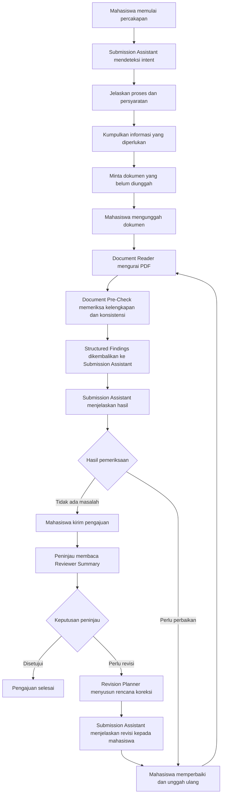

# FlowFix

> **Administrasi kampus berbantuan AI: cegah kesalahan pengajuan, pahami revisi, dan selesaikan proses dengan lebih jelas.**

FlowFix adalah konsep platform layanan perangkat lunak (SaaS) untuk membantu perguruan tinggi mengelola pengajuan administrasi mahasiswa. Platform ini menghubungkan formulir, dokumen, persyaratan, pemeriksaan, dan perbaikan dalam satu alur yang dapat dikonfigurasi.

**Tahap proyek: pengajuan ide awal hackathon.** Repositori ini memuat rancangan solusi dan arah pengembangan. Fitur serta integrasi teknologi yang dijelaskan merupakan rencana; target dampak akan diuji pada tahap prototipe.

Untuk meninjau ide, mulai dari README ini dan [presentasi proyek](pengumpulan/presentasi/flowfix.pdf). Untuk melanjutkan pekerjaan, baca [status dan tindak lanjut](dokumentasi/tindak-lanjut.md).

## Struktur Repositori

```text
FlowFix/
├── README.md
├── dokumentasi/
│   ├── arsitektur-sistem.md      # Komponen dan integrasi
│   ├── model-bisnis.md           # Pelanggan dan pendapatan
│   ├── prinsip-ai.md             # Pengawasan, privasi, dan batas AI
│   ├── rencana-validasi.md       # Pengujian masalah dan dampak
│   ├── rencana-pengembangan.md   # Cakupan dan tahapan produk
│   ├── audit-langflow.md         # Temuan pemeriksaan teknis
│   └── tindak-lanjut.md          # Status dan pekerjaan berikutnya
├── langflow/
│   ├── README.md                # Status dan petunjuk rancangan flow
│   ├── pemeriksaan-dokumen.json
│   ├── ringkasan-peninjau.json
│   ├── pemulihan-revisi.json
│   ├── asisten-status-pengajuan.json
│   ├── penyusun-notifikasi.json
│   ├── audit-status.json
│   └── pengarah-alur.json
├── prototipe/
│   └── index.html               # Simulasi antarmuka lokal
└── pengumpulan/
    ├── panduan.md
    ├── presentasi/              # PDF dan PowerPoint
    └── tangkapan-layar/         # Lima gambar untuk pengumpulan
```

Nama berkas menggunakan huruf kecil dan tanda hubung, dengan pengecualian nama standar seperti `README.md`. Setiap berkas Langflow mewakili satu fungsi; status dan batasannya dijelaskan di README Langflow. Penomoran hanya dipakai untuk urutan tangkapan layar. Konfigurasi `.bob/`, kredensial, serta catatan pembicara bersifat lokal dan tidak disertakan dalam Git.

## Latar Belakang Masalah

Pengajuan administrasi mahasiswa dapat memerlukan beberapa dokumen, aturan layanan yang berbeda, dan persetujuan manusia. Mahasiswa harus memahami persyaratan serta memastikan informasi pada formulir sesuai dengan dokumen pendukung. Ketika ada kekurangan atau ketidaksesuaian, pengajuan perlu direvisi.

Komentar revisi belum tentu langsung menjelaskan dokumen, kolom, atau aturan yang perlu diperbaiki. Mahasiswa dapat mengulang kesalahan, sementara staf dan dosen harus memeriksa informasi yang sama kembali. Kondisi ini berpotensi menambah beban pemeriksaan dan memperlambat penyelesaian layanan.

FlowFix berfokus pada **kesalahan pengajuan yang dapat dicegah dan kesulitan memahami langkah revisi**. Fokus awalnya adalah administrasi magang pada satu program studi atau departemen. Besarnya masalah pada calon institusi pengguna akan dipelajari melalui wawancara dan pengamatan proses.

## Solusi yang Diusulkan

FlowFix berpusat pada **Submission Assistant** — antarmuka percakapan yang memandu mahasiswa dari awal hingga selesai. Mahasiswa dapat memulai dengan percakapan biasa:

- "Saya ingin mengajukan magang."
- "Dokumen apa saja yang saya butuhkan?"
- "Kenapa pengajuan saya dikembalikan?"
- "Apa yang masih kurang?"
- "Apa status pengajuan saya?"

Submission Assistant memahami kebutuhan mahasiswa, menjelaskan persyaratan, mengumpulkan informasi bertahap, meminta dokumen yang diperlukan, meneruskan hasil pemeriksaan, dan menjelaskan umpan balik peninjau.

Setelah pengajuan dikirim, platform membantu pada dua tahap tambahan:

1. **Saat pemeriksaan:** peninjau memperoleh ringkasan fakta, referensi dokumen, dan bagian yang masih memerlukan verifikasi.
2. **Saat revisi:** Revision Planner menghubungkan komentar peninjau dengan aturan dan dokumen, lalu mengusulkan langkah koreksi yang spesifik.

Mahasiswa tetap meninjau perubahan dan mengirim sendiri pengajuannya. Staf atau dosen yang berwenang tetap mengambil keputusan administratif akhir.

## Pengguna Sasaran

| Pengguna | Kebutuhan yang Dibantu |
| --- | --- |
| Mahasiswa | Memahami persyaratan, menyiapkan pengajuan, mengetahui status, dan memperbaiki revisi |
| Staf administrasi | Memeriksa kelengkapan, menelusuri bukti, dan mengurangi pemeriksaan berulang |
| Dosen pembimbing atau peninjau akademik | Menilai pengajuan dan memberikan keputusan sesuai kewenangan |
| Administrator kampus | Mengatur formulir, persyaratan dokumen, SOP, dan tahap persetujuan |

Calon pelanggan institusionalnya adalah perguruan tinggi atau unit pengelola administrasi. Mahasiswa dan peninjau menjadi pengguna sehari-hari.

## Fitur Utama

| Fitur | Fungsi yang Direncanakan |
| --- | --- |
| **Alur layanan yang dapat dikonfigurasi** | Administrator menentukan formulir, dokumen wajib, referensi SOP, dan tahap persetujuan untuk setiap layanan |
| **Pemeriksaan awal dokumen berbantuan AI** | Mendeteksi kemungkinan kekurangan informasi atau ketidaksesuaian sebelum pengajuan dikirim |
| **Ringkasan untuk peninjau** | Menyajikan fakta penting, sumber dokumen, dan hal yang masih perlu diverifikasi |
| **Recovery Agent** | Mengusulkan koreksi berdasarkan komentar revisi, aturan, dan bukti; menampilkan nilai sebelum dan sesudah perubahan |
| **Pelacakan pengajuan dan riwayat tindakan** | Menampilkan status, versi dokumen, revisi, serta tindakan mahasiswa dan peninjau |

## Alur Penggunaan

Mahasiswa berinteraksi dengan FlowFix melalui percakapan. Submission Assistant menentukan kebutuhan mahasiswa, kemudian memandu proses yang sesuai.



Pemeriksaan AI membantu menemukan masalah berdasarkan bukti yang tersedia. Jika dokumen tidak terbaca, aturan ambigu, atau layanan AI tidak tersedia, pengajuan diarahkan ke pemeriksaan manusia.

## Nilai Inovasi

- **Pencegahan dan perbaikan dalam satu alur.** Temuan sebelum pengajuan dan bantuan setelah revisi menggunakan konteks pengajuan yang sama.
- **Koreksi yang spesifik dan dapat ditelusuri.** Usulan menghubungkan komentar peninjau, aturan, bukti dokumen, dan kolom yang terdampak.
- **Mesin layanan yang dapat digunakan ulang.** Formulir dan persyaratan dapat dikonfigurasi untuk beberapa layanan tanpa membuat aplikasi terpisah.

Contohnya, ketika surat magang diperbarui setelah pengajuan, Recovery Agent dapat membantu menemukan tanggal pada formulir yang perlu disesuaikan dan menjelaskan sumber perubahannya. Mahasiswa memutuskan koreksi tersebut sebelum pemeriksaan ulang.

Nilai tambah kombinasi ini akan dibandingkan dengan proses yang digunakan calon institusi pengguna.

## Rencana Penggunaan Langflow dan IBM Bob

**Langflow** direncanakan mengatur empat alur AI utama: Submission Assistant, Document Pre-Check, Reviewer Summary, dan Revision Planner. Submission Assistant adalah titik masuk percakapan utama bagi mahasiswa. Tiga alur lainnya mendukung proses: pemeriksaan dokumen, ringkasan untuk peninjau, dan usulan koreksi terstruktur. Tiga alur pendukung (Submission Router, Audit Record Generator, Notification Composer) melengkapi sistem.

**IBM Bob** direncanakan membantu pengembangan antarmuka, logika aplikasi, integrasi Langflow, serta pengujian. Hasil pekerjaannya tetap ditinjau oleh pengembang.

Hubungan langsung keduanya direncanakan melalui **Model Context Protocol (MCP)**: Bob memanggil alur Langflow menggunakan data uji sintetis, menerima hasil analisis, lalu membantu mengevaluasi hasil dan memperbaiki integrasi. Langflow mendukung penyediaan alur sebagai alat MCP, dan Bob mendukung koneksi ke server MCP. [Dokumentasi Langflow](https://docs.langflow.org/mcp-server), [dokumentasi IBM Bob](https://bob.ibm.com/docs/ide/configuration/mcp/mcp-in-bob).

```text
Pengembangan:
Pengembang → IBM Bob → MCP → Langflow → Hasil analisis
                ↑                              |
                └──── Evaluasi dan perbaikan ──┘

Penggunaan aplikasi:
Pengguna → Backend FlowFix → Langflow → Temuan atau usulan
        → Peninjauan pengguna → Tindakan yang disetujui
```

Keluaran integrasi yang ditargetkan adalah aplikasi yang terhubung dengan alur AI, disertai hasil pengujian. Backend mengendalikan hak akses, pemeriksaan isian, status pengajuan, dan penerapan perubahan yang sudah disetujui.

**Status teknis saat ini:** koneksi MCP lokal ke proyek contoh Langflow berhasil melewati handshake dan menampilkan tiga alat. FlowFix belum terverifikasi berjalan melalui koneksi tersebut. Tujuh berkas [rancangan Langflow](langflow/README.md) tersedia; implementasi diprioritaskan pada Submission Assistant dan tiga alur dokumen inti.

## Teknologi yang Direncanakan

| Bagian | Teknologi | Peran |
| --- | --- | --- |
| Antarmuka | React, Vite, Tailwind CSS | Formulir, unggahan, status, dan tampilan pemeriksaan |
| Backend | FastAPI | Logika layanan, hak akses, dan integrasi AI |
| Basis data | PostgreSQL melalui Supabase | Konfigurasi layanan, pengajuan, dan riwayat |
| Autentikasi dan penyimpanan | Supabase Auth dan Storage | Identitas pengguna dan penyimpanan dokumen privat |
| Orkestrasi AI | Langflow | Pemeriksaan awal, ringkasan, dan pemulihan revisi |
| Bantuan pengembangan | IBM Bob | Perencanaan, implementasi, perbaikan, dan pengujian kode |

Pemilihan model AI akan mempertimbangkan kemampuan analisis dokumen, dukungan bahasa, biaya, dan pengelolaan data. Detail rancangan tersedia dalam [arsitektur dan integrasi](dokumentasi/arsitektur-sistem.md).

## Dampak yang Diharapkan

| Indikator | Target Awal Pengujian |
| --- | --- |
| Waktu aktif mahasiswa menyelesaikan pengajuan | Penurunan median minimal 20% dibandingkan proses pembanding |
| Waktu aktif peninjau memeriksa pengajuan | Penurunan median minimal 20% tanpa menurunkan ketepatan keputusan |
| Keberhasilan memperbaiki revisi | Minimal 80% tugas revisi selesai dengan benar pada pengiriman ulang pertama |
| Pemahaman mahasiswa | Minimal 80% peserta dapat menjelaskan koreksi dan alasannya tanpa bantuan |
| Kesalahan saat pengajuan dikirim | Lebih sedikit dibandingkan proses pembanding |

**Angka tersebut merupakan target, bukan hasil yang sudah dicapai.** Evaluasi direncanakan menggunakan tugas yang setara, data sintetis, dan masukan calon pengguna. Rinciannya ada pada [rencana validasi](dokumentasi/rencana-validasi.md).

## Model Bisnis dan Potensi Pengembangan

FlowFix dirancang sebagai layanan berlangganan untuk institusi. Paket layanan dapat didasarkan pada jumlah layanan administrasi dan volume pengajuan, dengan biaya penyiapan awal untuk pemetaan SOP, konfigurasi, serta pelatihan bila diperlukan. Harga akan ditentukan setelah kebutuhan, biaya operasional, dan kesediaan membayar dipelajari.

Pengembangan dimulai dari alur magang lengkap dan satu layanan sederhana, yaitu surat keterangan mahasiswa aktif. Tahap berikutnya dapat mencakup cuti akademik, izin penelitian, dan layanan lain melalui konfigurasi yang sama.

Arsitektur multi-tenant direncanakan agar beberapa institusi memiliki pengguna, SOP, dan data masing-masing. Integrasi sistem informasi akademik, SSO, analitik, dan tanda tangan digital merupakan arah pengembangan lanjutan. Kapasitas layanan akan ditentukan melalui pengujian beban.

Baca [model bisnis](dokumentasi/model-bisnis.md) dan [arah pengembangan](dokumentasi/rencana-pengembangan.md).

## AI yang Bertanggung Jawab

FlowFix menempatkan persetujuan manusia sebagai bagian utama proses. Temuan AI perlu menyertakan bukti, informasi yang tidak pasti perlu ditandai, dan mahasiswa perlu memiliki jalur untuk meminta pemeriksaan manusia.

Rancangan juga mencakup pembatasan pengumpulan data, pemisahan akses antarinstansi dan pengguna, serta perlindungan terhadap instruksi berbahaya di dalam dokumen. Pengujian awal menggunakan data sintetis. Antarmuka direncanakan mudah dipahami, dapat diakses melalui ponsel, serta mendukung navigasi papan ketik dan pembaca layar.

Penjelasan lengkap tersedia pada [prinsip AI yang bertanggung jawab](dokumentasi/prinsip-ai.md).

## Pitch Deck

Presentasi ide awal terdiri dari delapan slide berbahasa Indonesia:

- [PowerPoint yang dapat diedit](pengumpulan/presentasi/flowfix.pptx)
- [PDF untuk pengumpulan](pengumpulan/presentasi/flowfix.pdf)

## Dokumen Pendukung

- [Arsitektur dan integrasi teknologi](dokumentasi/arsitektur-sistem.md)
- [Rencana validasi masalah dan dampak](dokumentasi/rencana-validasi.md)
- [Model bisnis dan posisi solusi](dokumentasi/model-bisnis.md)
- [Prinsip AI yang bertanggung jawab](dokumentasi/prinsip-ai.md)
- [Rencana pengembangan dan ruang lingkup](dokumentasi/rencana-pengembangan.md)
- [Rancangan dan status Langflow](langflow/README.md)
- [Audit teknis Langflow](dokumentasi/audit-langflow.md)
- [Status dan tindak lanjut](dokumentasi/tindak-lanjut.md)

## Prototipe Antarmuka dan Berkas Pengumpulan

[Prototipe antarmuka](prototipe/index.html) dapat dibuka langsung di peramban setelah repositori diunduh. Tampilan ini menjelaskan alur layanan, pemeriksaan awal, dan persetujuan koreksi menggunakan data simulasi. Prototipe belum terhubung ke backend atau menjalankan flow AI. Koneksi MCP lokal yang telah diuji masih terpisah dari integrasi aplikasi FlowFix.

Lima [tangkapan layar prototipe](pengumpulan/panduan.md#3-project--prototype-screenshot) disiapkan untuk melengkapi pengajuan ide. Diagram integrasi ditandai sebagai rancangan, sementara hasil pemeriksaan dan koreksi ditandai sebagai simulasi.


[Panduan pengumpulan](pengumpulan/panduan.md) menjelaskan berkas untuk kolom tautan proyek, pitch deck, dan screenshot.
