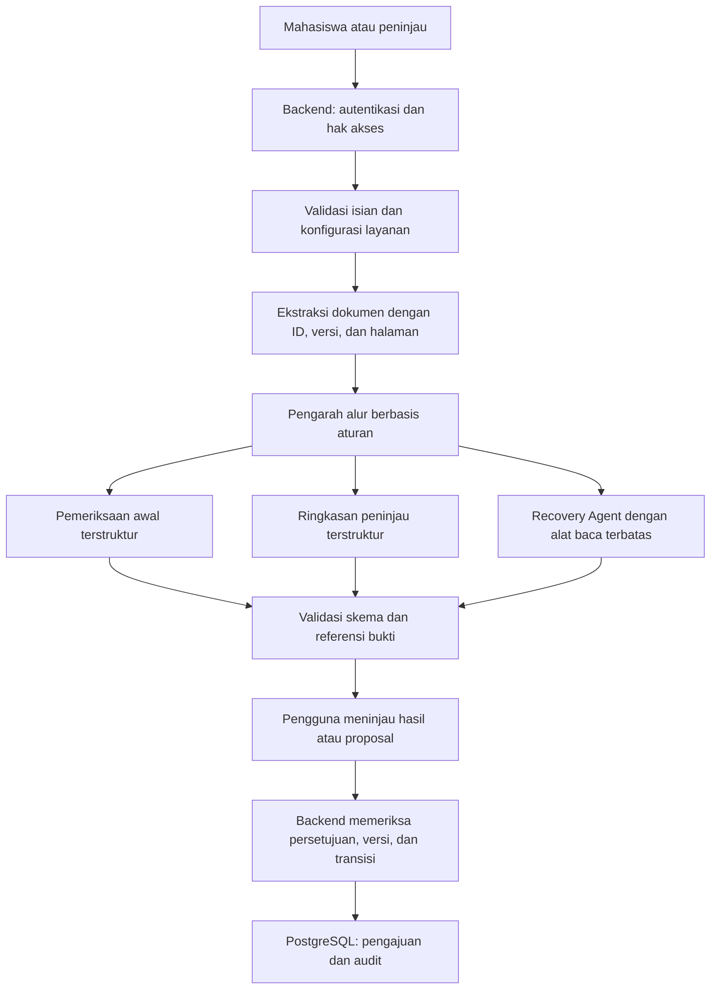

# Audit Teknis Langflow

Tanggal pemeriksaan: 29 September 2026. Acuan kode: commit `7e8a33a`.

**Catatan pembaruan:** laporan di bawah merekam kondisi saat audit awal. Setelah audit, peluncur MCP lokal diperbaiki dan handshake serta daftar tiga alat contoh berhasil diuji. Nama dan lokasi berkas kemudian dirapikan, dan README Langflow diperbarui agar sesuai status rancangan. Isi ketujuh ekspor tetap sama; keberhasilan eksekusi FlowFix belum diverifikasi. Status terbaru tersedia pada [status dan tindak lanjut](tindak-lanjut.md).

## Kesimpulan

Tiga fungsi utama FlowFix sudah tercermin dalam prompt pemeriksaan awal, ringkasan peninjau, dan pemulihan revisi. Namun, tujuh berkas yang tersedia masih berupa rangkaian masukan, prompt, model bahasa, dan keluaran percakapan. Berkas tersebut belum membuktikan implementasi sistem pengajuan, agent dengan pemanggilan alat, orkestrasi lintas flow, penyimpanan audit, atau pengiriman notifikasi.

Arsitektur yang paling sesuai dengan README adalah **tiga alur AI utama, dengan backend sebagai pengendali hak akses, status, persetujuan, dan penyimpanan**. Prioritas perbaikan adalah kompatibilitas model dan komponen, kontrak masukan/keluaran, serta pemisahan kewenangan AI dari logika administrasi.

## Pemeriksaan yang Dilakukan

- Membaca tujuh ekspor JSON, README utama, README Langflow, arsitektur, ruang lingkup, dan prototipe HTML.
- Memeriksa validitas JSON, keunikan ID node, keberadaan ujung koneksi, nama port keluaran, kolom tujuan, variabel prompt, dan siklus graf. Ketujuh berkas lulus pemeriksaan struktur dasar ini.
- Menemukan 43 node: 22 Chat Input, 7 Prompt Template, 7 model bahasa, dan 7 Chat Output. Tidak ditemukan node Agent, Structured Output, pemanggil flow lain, penyimpanan basis data, atau pengirim notifikasi.
- Memeriksa layanan lokal: `/health` merespons 200 dan `/api/v1/version` melaporkan Langflow 1.12.1.
- Menggunakan konfigurasi koneksi Langflow yang sudah tersedia untuk membaca daftar flow dan katalog komponen. Kredensial tidak dimasukkan ke laporan atau repositori.
- Tidak menemukan nama FlowFix dalam daftar flow yang terlihat oleh koneksi tersebut. Pencarian berdasarkan tujuh ID ekspor mengembalikan 404. Hal ini berlaku untuk instance dan akses yang diperiksa; flow bisa saja berada pada workspace lain atau telah diimpor dengan ID baru.
- Membandingkan metadata ekspor dengan katalog komponen instance lokal.

Pengujian ini tidak menjalankan inferensi ke penyedia AI, tidak membuat flow baru, dan tidak mengubah flow yang tersimpan. Karena flow target tidak ditemukan pada instance yang diperiksa, keberhasilan impor, eksekusi model, serta kualitas keluaran belum terverifikasi. Lulus struktur JSON tidak sama dengan lulus eksekusi Langflow.

## Pemetaan Tujuh Flow

| Flow | Kesesuaian terhadap README | Saran |
| --- | --- | --- |
| [Pemeriksaan dokumen](../langflow/pemeriksaan-dokumen.json) | Fungsi inti sesuai; masukan berupa teks yang disediakan pemanggil | Pertahankan, tambah validasi data dan keluaran terstruktur |
| [Ringkasan peninjau](../langflow/ringkasan-peninjau.json) | Fungsi inti sesuai; instruksi menyertakan sumber dan verifikasi manusia | Pertahankan, pastikan setiap sumber merujuk dokumen yang benar |
| [Pemulihan revisi](../langflow/pemulihan-revisi.json) | Prompt sesuai tujuan koreksi dengan persetujuan manusia | Pertahankan, tambah versi pengajuan, sumber terstruktur, dan penanganan ketidakpastian |
| [Asisten status pengajuan](../langflow/asisten-status-pengajuan.json) | Termasuk rencana pengembangan lanjutan | Tunda hingga alur utama dan sumber status sudah berjalan |
| [Audit status](../langflow/audit-status.json) | Bertentangan dengan pembagian tanggung jawab backend dalam arsitektur | Pindahkan perubahan status dan pencatatan audit ke kode backend serta basis data |
| [Pengarah alur](../langflow/pengarah-alur.json) | Baru mengusulkan rute; tidak menjalankan alur berikutnya | Gunakan pengarah alur berbasis aturan; analisis risiko AI dapat menjadi fungsi tambahan |
| [Penyusun notifikasi](../langflow/penyusun-notifikasi.json) | Baru menyusun isi pesan; notifikasi merupakan perluasan | Tunda, lalu pisahkan penyusunan pesan dari penjadwalan dan pengiriman |

## Temuan dan Prioritas Perbaikan

### P0 — Model default sudah melewati jadwal penghentian

Ketujuh node model menggunakan `gemini-2.0-flash`. Dokumentasi Google mencantumkan 1 Juni 2026 sebagai jadwal penghentian model tersebut. Jangan mengandalkannya sebagai model default untuk implementasi baru. Ketersediaan model pada akun pengguna belum diuji dalam audit ini. [Jadwal model Google](https://ai.google.dev/gemini-api/docs/deprecations).

Pilih model aktif melalui konfigurasi penyedia pada instance yang digunakan. Uji satu permintaan kecil dengan data sintetis terlebih dahulu, termasuk dukungan keluaran terstruktur, biaya, dan waktu respons. Gunakan pengaturan penyedia atau referensi variabel rahasia agar kunci tidak disalin ke ekspor JSON. Kunci dalam tujuh berkas yang diperiksa memang kosong; hal itu tepat untuk berkas publik, tetapi konfigurasi runtime tetap diperlukan.

### P0 — Status dan audit tidak boleh bergantung pada jawaban model

Flow 05 meminta model membuat `updated_state`, aktor, dan timestamp, sementara deskripsinya mengklaim penyimpanan serta sumber status utama. Tidak ada komponen penyimpanan di graf. Model hanya menghasilkan usulan teks; hasil itu tidak membuktikan bahwa tindakan benar-benar dilakukan pengguna.

Ini berbeda dari [arsitektur utama](arsitektur-sistem.md#batas-tindakan-ai), yang menempatkan perubahan status pada backend.

Backend perlu memvalidasi aktor, kewenangan, status sebelumnya, dan versi pengajuan sebelum melakukan transisi. Identitas aktor berasal dari autentikasi, waktu berasal dari server, dan perubahan serta peristiwa audit disimpan dalam satu transaksi. Permintaan berulang harus tidak menggandakan tindakan. AI boleh membantu merangkum riwayat yang sudah tersimpan, tetapi tidak menentukan fakta audit.

### P1 — Keluaran JSON baru berupa instruksi prompt

Enam flow yang menjanjikan JSON berakhir pada keluaran teks model menuju Chat Output. Tidak ada komponen Structured Output atau validator skema. Contoh prompt menggunakan bentuk seperti `true | false`, `N`, dan gabungan pilihan dengan tanda `|`; itu merupakan petunjuk format, bukan JSON yang dapat langsung divalidasi.

Gunakan Structured Output atau keluaran terstruktur Agent, kemudian validasi kembali di backend. Periksa tipe nilai, pilihan status, kolom yang boleh dikoreksi, serta keterkaitan sumber dengan dokumen milik pengajuan. JSON yang valid secara sintaks tetap bisa memuat fakta atau referensi yang salah. Jika validasi gagal, jangan menerapkan koreksi atau menghasilkan status lolos; tandai untuk pemeriksaan manusia. [Structured Output Langflow](https://docs.langflow.org/structured-output).

### P1 — Kontrak masukan dan metadata komponen perlu diuji

Setiap flow memiliki dua sampai empat Chat Input dengan nilai kosong. Instruksi membuka Playground saja belum menjelaskan cara memasukkan SOP, formulir, dokumen, dan komentar ke node yang berbeda. Parameter masukan umum dapat diterapkan ke beberapa komponen; pemetaan eksplisit tetap diperlukan.

Untuk MVP, gunakan satu objek konteks terstruktur yang diurai dan diperiksa, atau dokumentasikan pemetaan parameter per komponen melalui API. Sertakan contoh permintaan yang dapat diulang dengan data sintetis. [Pemanggilan flow melalui API](https://docs.langflow.org/api-flows-run).

Selain itu, seluruh 43 node ekspor tidak menyertakan `template.code`, dan metadata output tidak mencantumkan `method`. Katalog lokal memiliki metadata tersebut. Model OpenAI-compatible pada katalog juga terdaftar sebagai `ext:openai:OpenAIModelComponent@official`, sedangkan ekspor memakai `OpenAIModelComponent` tanpa metadata ekstensi.

Perbedaan ini adalah risiko kompatibilitas yang perlu diuji, bukan bukti pasti bahwa impor akan gagal. Pastikan lokasi flow yang sebenarnya, uji impor pada salinan sementara di versi target, perbarui komponen melalui katalog, lalu ekspor ulang hasil yang berhasil dijalankan. Jangan hanya mengubah nama tipe secara manual dan menganggapnya sudah kompatibel.

### P1 — Pemulihan revisi belum memiliki pengaman versi

Flow 03 sudah meminta nilai lama, nilai baru, bukti, serta persetujuan mahasiswa. Namun, kontrak keluaran belum mewajibkan ID dan versi pengajuan, ID dan versi dokumen, ID/versi aturan, atau status ketika bukti tidak cukup. Nama berkas dan halaman digabung dalam teks bebas.

Tambahkan referensi terstruktur dan versi dasar proposal. Sebelum menerapkan perubahan, backend memeriksa bahwa pengajuan masih dapat direvisi, pengguna berwenang, versi belum berubah, nilai lama cocok, kolom diperbolehkan, dan sumber masih berlaku. Usulan lama harus ditolak setelah data atau bukti berubah. Persetujuan koreksi dan pengiriman ulang tetap dua tindakan terpisah.

### P1 — Peran agent dan orkestrasi belum diwujudkan

Semua flow hanya memakai model bahasa satu langkah. Nama “Agent” belum disertai komponen Agent, alat pengambilan bukti, atau pemanggilan alat. Flow 06 mengeluarkan `recommended_next_flow` sebagai teks, tanpa komponen yang mengeksekusi tujuan tersebut. Flow 07 tidak memiliki pengirim pesan atau penjadwal SLA.

Untuk fungsi inti, rangkaian analisis dengan keluaran terstruktur sudah memadai. Jika kemampuan agent perlu ditunjukkan, fokuskan pada Recovery Agent dengan alat baca terbatas seperti mengambil pengajuan, membaca aturan, dan mencari bukti. Setiap alat tetap memeriksa akses di backend. Persetujuan serta perubahan status tetap dikendalikan aplikasi. [Agent dan pemanggilan alat](https://docs.langflow.org/agents).

### P1 — Koneksi MCP untuk membangun flow berbeda dari menyediakan flow sebagai alat

Konfigurasi global Bob yang diperiksa memuat server `langflow` dengan perintah `uvx --from lfx lfx-mcp`. Koneksi ke API lokal melalui pengaturan yang tersedia dapat digunakan untuk membaca data. Ini mendukung adanya konfigurasi alat pengembangan, tetapi tidak membuktikan riwayat pemanggilan Bob atau keberhasilan eksekusi tujuh flow.

Semua ekspor memiliki `mcp_enabled: false`. Untuk skenario README berupa Bob memanggil flow melalui MCP, flow yang dipilih perlu disediakan pada server MCP proyek, lalu daftar alat dan satu pemanggilan uji diperiksa. Chat Output sudah ada pada semua graf, tetapi keberadaannya saja belum membuktikan flow tersedia sebagai alat. Pemanggilan REST backend merupakan jalur terpisah dan tidak bergantung pada penandaan MCP ini. [Server MCP Langflow](https://docs.langflow.org/mcp-server).

### P1 — Penyimpanan pesan dan batas kepercayaan perlu diperjelas

Seluruh 29 node Chat Input/Output mengaktifkan `should_store_message`. Input sesi kosong pada ekspor. Hal ini belum membuktikan kebocoran, tetapi dapat menambah salinan data SOP, formulir, dan dokumen pada penyimpanan percakapan jika digunakan dengan pengaturan runtime yang mengizinkannya.

Untuk analisis dokumen yang tidak memerlukan riwayat percakapan, nonaktifkan penyimpanan pesan. Jika riwayat diperlukan, backend menetapkan identitas sesi yang terisolasi serta kebijakan akses dan retensi. ID tenant dari masukan klien tidak boleh dianggap sebagai bukti otorisasi.

Pisahkan aturan tepercaya dari isi dokumen atau komentar yang dianalisis. Instruksi di dokumen tidak boleh mengubah kewenangan aplikasi, status, atau pilihan alat. Saat backend belum tersedia, pembatasan tersebut belum dapat ditegakkan hanya dengan prompt.

### P2 — Konfigurasi layanan dan dokumentasi belum konsisten

Flow 01 secara eksplisit mengasumsikan SOP magang. Contoh ringkasan juga mengasumsikan perusahaan dan periode magang. Ini dapat dipakai untuk kasus awal, tetapi belum membuktikan penggunaan ulang untuk surat mahasiswa aktif. Jadikan konfigurasi layanan, persyaratan, dan daftar kolom sebagai data masukan yang dipilih backend.

README utama masih menyebut rancangan tiga alur AI, sementara README Langflow mengklaim tujuh flow sudah mengimplementasikan arsitektur serta kemampuan audit/orkestrasi. Dokumentasi perlu membedakan berkas rancangan, flow yang sudah diimpor, eksekusi model yang berhasil, dan integrasi aplikasi yang sudah diuji. Status penggunaan Bob perlu disertai bukti pekerjaan yang memang tersedia.

## Bentuk Sistem yang Disarankan

Kontrak konteks minimal yang disarankan: ID pengajuan, versi pengajuan, versi konfigurasi layanan, versi SOP, isian formulir, dan dokumen dengan ID/versi/halaman serta status ekstraksi. Backend menyediakan konteks yang sudah diotorisasi. Komentar dan bukti revisi ditambahkan untuk proses pemulihan.

Kontrak hasil minimal: jenis analisis, status, temuan atau proposal, sumber bukti terstruktur, versi konteks yang dianalisis, dan kebutuhan pemeriksaan manusia. Identitas proposal serta hasil disimpan dan dikaitkan ke pengajuan oleh backend, bukan dipercayakan kepada model untuk menebak.

## Prioritas untuk Submission Awal

Untuk pengumpulan ide, implementasi backend lengkap bukan prasyarat untuk menjelaskan rancangan. Kebutuhan terdekat adalah konsistensi dan kejelasan status pekerjaan:

- Pertahankan tiga fungsi AI inti sebagai ruang lingkup utama; tempatkan chatbot serta notifikasi pada rencana pengembangan.
- Perbaiki README Langflow agar menyebut berkas yang tersedia sebagai rancangan flow yang belum diverifikasi eksekusinya. Hindari klaim sudah menyimpan audit, mengirim notifikasi, atau menjalankan orkestrasi otomatis.
- Jelaskan pemisahan peran: Langflow menganalisis, backend mengendalikan tindakan dan menyimpan data, sedangkan Bob membantu pengembangan melalui koneksi MCP yang perlu diuji sesuai skenario integrasi.
- Samakan diagram dan penjelasan pada README, dokumentasi submission, serta pitch deck. Pertahankan label simulasi pada prototipe dan label rancangan pada integrasi yang belum berjalan.
- Jika ingin menyertakan bukti teknis tambahan, prioritaskan satu flow inti yang berhasil dijalankan dengan data sintetis dan model aktif, disertai hasil serta batasannya.

## Urutan Implementasi yang Disarankan

1. Pastikan instance/workspace tujuan, model aktif, dan komponen yang kompatibel. Jalankan satu pemeriksaan awal sintetis serta simpan ekspor yang telah diuji.
2. Rapikan masukan dan keluaran tiga flow inti; tetapkan versi serta referensi bukti.
3. Bangun backend minimal untuk pengajuan, otorisasi, perubahan status, audit, dan persetujuan koreksi. Pengarah alur menggunakan kondisi aplikasi yang eksplisit.
4. Hubungkan antarmuka ke backend dan backend ke Langflow. Prototipe HTML saat audit masih menggunakan hasil simulasi dan belum memiliki pemanggilan API.
5. Lengkapi alat baca Recovery Agent jika diperlukan untuk kemampuan agent, kemudian uji MCP Bob secara terpisah.
6. Uji kasus valid, informasi hilang, bukti bertentangan, dokumen tidak terbaca, proposal kedaluwarsa, akses tidak sah, instruksi berbahaya, serta kegagalan model.
7. Tambahkan chatbot dan notifikasi setelah alur inti stabil. Dokumentasikan hasil pengujian sesuai bukti yang diperoleh.

Audit ini menambahkan laporan analisis saja. Ketujuh ekspor flow dan konfigurasi layanan tetap seperti saat diperiksa.
